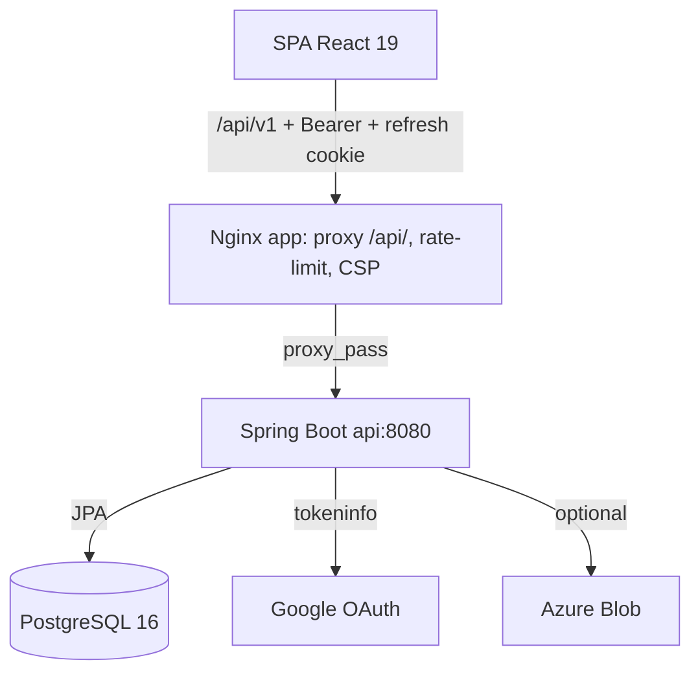
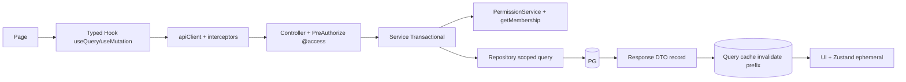
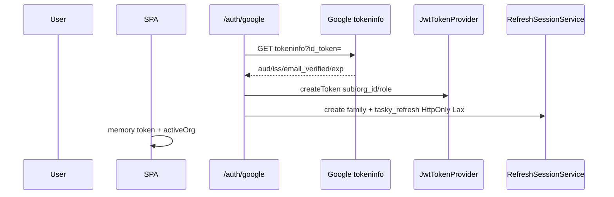
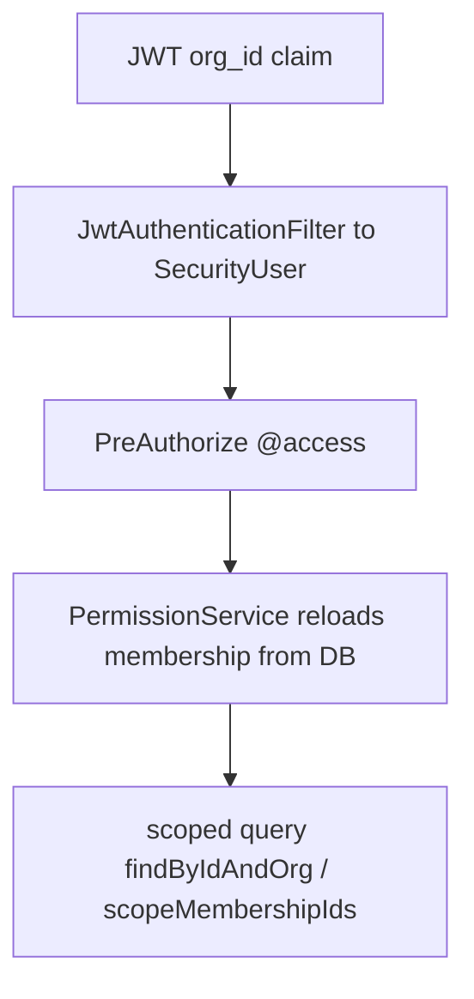
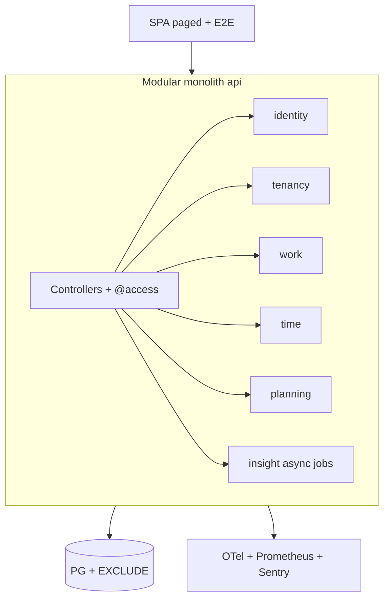

# TaskY — Deep Architectural & Engineering Assessment

> Method: code is the source of truth. Docs (`README.md`, `docs/ANALISE_TASKY.md`,
> `docs/ROADMAP_STATUS.md`, skill files) treated as claims to validate.
> Evidence cites `file path + class / method / migration`.
> Confidence levels: **Confirmed / Highly probable / Probable / Needs validation**.
> Date: 2026-09-14. Versions: `api 1.1.0`, `app 1.1.0`. Migrations: V1–V41.

---

## Table of Contents

1. [Executive Summary](#1-executive-summary)
2. [System Overview](#2-system-overview)
3. [Repository Inventory](#3-repository-inventory)
4. [Current Architecture](#4-current-architecture)
5. [Technology Stack Assessment](#5-technology-stack-assessment)
6. [Domain Architecture](#6-domain-architecture)
7. [Backend Architecture](#7-backend-architecture)
8. [Frontend Architecture](#8-frontend-architecture)
9. [Database Architecture](#9-database-architecture)
10. [Multi-Tenancy Audit](#10-multi-tenancy-audit)
11. [Authentication Security Audit](#11-authentication-security-audit)
12. [Authorization / RBAC Audit](#12-authorization--rbac-audit)
13. [Time Tracking Integrity Audit](#13-time-tracking-integrity-audit)
14. [API Architecture](#14-api-architecture)
15. [UX / Product Engineering Assessment](#15-ux--product-engineering-assessment)
16. [Testing Architecture](#16-testing-architecture)
17. [Observability](#17-observability)
18. [Infrastructure / Docker](#18-infrastructure--docker)
19. [CI/CD](#19-cicd)
20. [Performance & Scalability](#20-performance--scalability)
21. [Reliability & Resilience](#21-reliability--resilience)
22. [Threat Model](#22-threat-model)
23. [Technical Debt Register](#23-technical-debt-register)
24. [Architectural Debt Register](#24-architectural-debt-register)
25. [Existing Roadmap Validation](#25-existing-roadmap-validation)
26. [What Should NOT Be Changed](#26-what-should-not-be-changed)
27. [Critical Findings](#27-critical-findings)
28. [Target Architecture](#28-target-architecture)
29. [Migration Strategy](#29-migration-strategy)
30. [Prioritized Improvement Roadmap](#30-prioritized-improvement-roadmap)
31. [Detailed Engineering Task Breakdown](#31-detailed-engineering-task-breakdown)
32. [Testing Strategy](#32-testing-strategy)
33. [Security Hardening Strategy](#33-security-hardening-strategy)
34. [Observability Strategy](#34-observability-strategy)
35. [Performance Strategy](#35-performance-strategy)
36. [Documentation Strategy](#36-documentation-strategy)
37. [Architecture Principles](#37-architecture-principles)
38. [Enterprise Readiness Checklist](#38-enterprise-readiness-checklist)
39. [Final Scorecard](#39-final-scorecard)
40. [Final Recommendations + Analytical Q&A](#40-final-recommendations--analytical-qa)

---

## 1. Executive Summary

**What TaskY is today (Confirmed):** multi-tenant work + time management SaaS
(Clockify + Asana hybrid). Layered feature-based monolith: Spring Boot Java 21
backend (`api/`, v1.1.0) + React 19 TypeScript frontend (`app/`, v1.1.0) +
PostgreSQL 16 + Flyway (41 migrations V1–V41) + Docker Compose (api/app/db) +
Nginx reverse proxy. Auth: Google OAuth `id_token` → server-minted HS256 JWT
(in-memory) + opaque refresh family in HttpOnly `tasky_refresh` cookie.

**Verdict: no rewrite justified.** The system can evolve into enterprise SaaS as a
**hardened modular monolith**. Strongest assets: tenant-aware repository pattern
in most domains, centralized `PermissionService`, transactional advisory-lock
protocol for timers/dependencies, append-only audit with DB trigger, negative
security tests, ProblemDetails + correlation ID, reproducible CI with
scans/SBOM. Weakest points: inconsistent tenant enforcement on 3–4 paths,
missing `@Version` on `TimeEntry`, dead approval-lock enforcement, unbounded
report/export queries, no metrics/tracing/backups, no E2E.

**P0 — fix before sensitive enterprise data (6 items):**

1. Dept write tenant-confusion (`DepartmentController` skips `path == activeOrg`).
2. `TimeEntryService.deleteEntry` bypasses approval/period lock.
3. `ActivityStatus.IN_TESTING` enum vs V9 DB CHECK mismatch.
4. Activity create gated on `canReadProject` instead of `canManageProject`.
5. Checklist writes gated on `canReadActivity` only.
6. Side-effecting `GET /reports/exports` (must be POST).

All have small, safe, independently revertible fixes. See §27 and phase-1 doc.

**Target:** stay monolith; enforce module boundaries via package rules + ArchUnit;
add DB constraints for 3 invariants; add optimistic locking where lost-update
matters; paginate/stream exports; add OpenTelemetry + JSON logs + Postgres PITR;
add Playwright E2E. No microservices, K8s, CQRS, event-sourcing, Kafka, Redis,
search-infra, or WebSockets yet — none justified by observed load.

---

## 2. System Overview

| Component | Technology (actual) | Purpose | Runtime / Deploy | Criticality |
|---|---|---|---|---|
| `api/` | Java 21, Spring Boot (web/data-jpa/security/oauth2-resource-server/validation/actuator/flyway), JJWT 0.12.6 HS256, springdoc 2.8.6, azure-blob 12.29.0, Lombok | REST API `/api/v1`, authz, domain logic | `eclipse-temurin:21-jre`, Compose `api` :8080, prod behind `app` proxy | Critical |
| `app/` | React 19, TS 5.7, Vite 6, Tailwind 4, Radix, TanStack Query 5.64, Zustand 5, Router 7, RHF 7.54, Zod 3.24, Recharts 2.15, dnd-kit 6/10, Bun 1, Vitest 3 + MSW 2 | SPA, pt-BR UI | `nginx:stable-alpine` :8080, serves `dist` + proxies `/api/` | Critical |
| `db` | PostgreSQL 16-alpine, Flyway 41 migrations | System of record, TZ-aware `timestamptz` | Compose volume `pgdata`, `pg_isready` healthcheck | Critical |
| Nginx | `nginx.conf` + `nginx.conf.template` + `nginx-security-headers.conf` | SPA hosting, `/api/` proxy, rate-limit 10r/s burst 30, security headers, cache policy | In `app` image | High |
| CI/CD | 3 workflows: `api-ci.yml`, `app-ci.yml`, `quality.yml` (CodeQL, Trivy, Gitleaks, SBOM, provenance) | Test/build/push `api-$V`/`app-$V` + releases | DockerHub + GHCR | High |
| Auth ext | Google OAuth2 `tokeninfo` endpoint | Identity proofing | External | Critical |
| Storage | Azure Blob SDK + local `TASKY_UPLOAD_DIR` fallback | Attachments/documents | Hybrid, metadata-first | Medium |

Domain scope actually implemented (Confirmed via package listing — broader than
old docs): organization, department, membership, membertype, project,
projectcolumn, activity (+comments/attachments/checklist/dependencies/
events/mentions), activitytemplate/recurrence, timeentry, timesheet, capacity
(schedules/holidays/leave), report (+saved/export jobs), request (demand hub +
assignees), sector overview, document (+versions/attachments), file/stored-file,
notification (+preferences), audit, search, privacy/data-export, settings,
session/refresh.

---

## 3. Repository Inventory

**Root:** `.devcontainer/`, `api/`, `app/`, `docs/`, `scripts/`,
`.github/workflows/` (3 files), `.opencode/` (8 `tasky-*` skills),
`docker-compose.yml` (dev, 59 lines) + `docker-compose.production.yml` (51 lines),
`build.gradle` + `api/build.gradle` + `settings.gradle`, `.env.example` (11 keys),
`README.md` (122 lines, honest non-enterprise disclaimer).

**Backend — 289 Java files** under `api/src/main/java/io/tasky/api/`:

- `api/` — 25 `@RestController` + ~113 DTO records + `common/GlobalExceptionHandler`
  (`activity`, `activitytemplate`, `audit`, `auth`, `capacity`, `common`,
  `department`, `document`, `file`, `membership`, `membertype`, `notification`,
  `organization`, `privacy`, `project` (+assignments, cross-dept),
  `projectcolumn`, `report`, `request`, `search`, `sector`, `setting`,
  `timeentry`, `timesheet`)
- `domain/` — 26 services + 43 repositories (64 `@Query`) + 41 `@Entity`
  (same sub-packages + `session`, `storage`, `timesheet`, `user`)
- `security/` — `SecurityConfig`, `JwtAuthenticationFilter`, `JwtTokenProvider`,
  `GoogleTokenVerifier`, `PermissionService (@Component("access"))`,
  `SecurityUser (record)`, `SuperAdminService`
- `config/` — `AppConfig` (Flyway bean, Fibonacci weights `[1,2,3,5,8,13]`),
  `TaskYProperties` (`tasky.*`)
- Resources: `application.yml` + `-dev/-prod/-test.yml`, `db/migration/V1–V41`

**Frontend `app/src/`:**

- `app/` — `App.tsx`, `router.tsx` (313 lines), `layouts/`, `providers/`
- `core/api/` — `apiClient.ts` (150L), `interceptors.ts`, `types.ts` (1163L),
  `hooks/index.ts` (1635L, ~90 hooks), `msw/handlers.ts` (650L)
- `core/auth/` — `authStore.ts` (214L), `permissions.ts`, `googleOAuth.ts`,
  `demoAuth.ts`, `authTypes.ts`
- `core/org/OrgContext.ts`, `core/tracker/timeTrackerStore.ts`,
  `core/config/routes.ts + runtimeConfig.ts`, `core/errors/ErrorBoundary.tsx`
- `modules/` — 12: activities, admin, auth, calendar, dashboard, projects,
  reports, requests, sector, settings, time-tracker, timeline, timesheet, work
- `shared/` — activities/charts/documentation/feedback/forms/kanban/layout/ui
  (shadcn)/hooks (`async.ts`, `useHoursMask.ts`)/lib (`cn`, `dates`,
  `formatters`, `safeUrl`, `storage`, `timezone`)
- Build: `vite.config.ts` (proxy `/api` → 8080), `vitest.config.ts` (jsdom),
  `components.json` (shadcn zinc), `index.html` (pt-BR dark, `runtime-config.js`),
  `nginx.conf` + `nginx.conf.template` + `nginx-security-headers.conf`,
  `40-tasky-runtime-config.sh`, `Dockerfile` (bun build → nginx)

**DB:** 41 migrations (see §9). **Tests:** backend 20 classes +
`BaseIntegrationTest` (shared Testcontainers pg16); frontend 13 test files
(MSW + Vitest). **Scripts:** `backup-postgres.sh` (43L, dump→gzip→verify),
`restore-postgres.sh` (102L, temp-DB validate + mandatory confirm).
**Docs:** `ANALISE_TASKY.md` (~1100L, 2026-08-01), `ROADMAP_STATUS.md` (63L),
`limitations.md`, `onboarding.md`, `runbooks/backup-restore.md`,
`quality/security-test-matrix.md`, `governance/lgpd.md`,
`quality/accessibility.md`, `frontend-demo-policy.md`.

---

## 4. Current Architecture

**Classification (Confirmed):** layered feature-based monolith with domain
packages — not hexagonal/clean. Controllers → Services (`@Transactional`) →
Repositories (Spring Data). No ports/adapters, no domain events, no module
enforcement. Dual `@Transactional` on `TimeEntryController` + `TimeEntryService`
(redundant nesting). Frontend: server-state (Query) + client-state (Zustand)
split, largely correct, 3 stores + hierarchical query keys.

**Key flows:**

- Auth: `POST /auth/google {idToken}` → tokeninfo verify → `getOrCreateUser` →
  `acceptPendingInvitations` → JWT (first org) + refresh family cookie →
  `POST /auth/refresh` rotation → `POST /auth/switch-org {orgId}` re-mint.
- Tenant: every controller derives `orgId` from `SecurityUser.activeOrganizationId`
  (JWT), except Membership/Department-list/Project-list which validate
  `pathOrg == activeOrg`. Dept writes are the exception (P0, §10).
- Time: widget start/pause/resume/stop (Zustand ticker, client pause math) →
  `POST /time-entries[/timer/start|/manual]` → advisory lock + running/overlap
  checks → `PATCH /{id}/{pause|resume|stop|submit|approve|reject}` →
  `GET /running` resume.
- Reports: `GET /reports/*?from&to&projectId&membershipId` →
  `requireFinancialReportsAccess` + `scopedMembershipIds` → native aggregates.
- Deploy: dev exposes api directly (127.0.0.1:8080); prod hides api, app :8080
  only. No TLS in repo (ingress responsibility — documented). No api/app
  healthcheck, no limits, single volume.

---

## 5. Technology Stack Assessment

**Backend — keep all.** Java 21 + Spring Boot + JPA/Flyway/Postgres appropriate;
`spring-boot-flyway` module + `enabled:true` in 3 yml correct. JJWT 0.12.6 HS256
fine for monolith (no RS256 until multi-service). Actuator health-only in prod
correct. Azure-blob SDK present but storage metadata-first — keep dep, finish
presigned flow later. Lombok + records good. Overuse: `@Transactional` on
controllers (remove). Underuse: `@Version` (4 entities only), `EntityGraph`.

**Frontend — keep all.** React 19 + Query + Zustand split correct; Router 7 lazy
+ `lazyWithRetry`; RHF + Zod; Radix; Tailwind 4 CSS-first; Recharts; dnd-kit;
Bun; Vitest + MSW. Overuse: Radix breadth (~22 pkgs, ~545 kB bundle) —
code-split charts/admin. Underuse: only `useMoveActivity` optimistic — extend to
checklist/timesheet where safe. `OrgContext` largely unused vs
`authStore.activeOrg` — remove/merge.

**Infra — keep Compose + Nginx + GH Actions.** Public images correct
(`temurin`, `oven/bun:1`, `nginx:stable-alpine`; never revert to `dhi.io`).
Not production-grade yet: unpinned tags, root api user, no HEALTHCHECK, no
limits, no TLS, no metrics, no PITR. Fix those — do not add K8s.

Do not recommend technology changes merely because newer alternatives exist.
Every infra addition in target (§28) is tied to an observed gap.

---

## 6. Domain Architecture

| Context | Aggregates | Invariants | Owner service |
|---|---|---|---|
| Identity | User, RefreshSession (family) | email/sub unique; rotation atomic | Auth, RefreshSessionService |
| Tenancy/Membership | Organization, OrganizationMembership, ManagerDepartment, DeptMemberType | 1 active membership/user+org; last-admin block; invite lifecycle | Membership, Organization |
| Org structure | Department, ProjectColumn | dept name UQ per org | Department, ProjectColumn |
| Work | Project, Assignment, CrossDeptAccess, Activity, Dependency, Checklist, Comments, Attachments | DAG acyclic; same-project deps/subtasks; depth ≤5; Fibonacci weight; status/position | Project, Activity |
| Time | TimeEntry | 1 running/member (DB partial UQ); no overlap (app-only); end>start; approval FSM | TimeEntry |
| Planning | TimesheetPeriod, WorkSchedule, Leave, Holiday | period UQ org+member+range; schedule/leave EXCLUDE no-overlap | TimesheetPeriod, Capacity |
| Demand | InternalRequest, RequestComment, Assignees | key UQ org+key; status FSM | InternalRequest |
| Knowledge | Document, Versions, StoredFile | version UQ doc+no | Document, FileStorage |
| Insight | SavedReport, ExportJob (+ native queries) | owner-or-admin visibility | Report, Export, SavedReport |
| Collaboration | Notification (+prefs), AuditEvent (append-only trigger) | event_key dedup UQ; audit immutable | Notification, Audit |

Transaction boundaries align with aggregates except reports (read-only 8-query
fan-out, acceptable) and export create+download double-query (wasteful).
No domain events — sync service calls + `createOnce` notifications. Do not add
events/Kafka until async export/reminder jobs need it.

Strongest coupling: `ActivityService` (1169L) — God-service risk;
`ReportRepository` (707L, 15+ native queries); `PermissionService` (356L) —
good centralization, needs split by context.

---

## 7. Backend Architecture

Pattern: thin-ish controllers → `@Transactional` services → Spring Data repos;
DTO records; `GlobalExceptionHandler` → ProblemDetail + `code` + `traceId`.
Bean Validation on DTOs; business rules in services.

**Smells (Confirmed):**

- God service `ActivityService` 1169L (CRUD + move/reorder + deps + subtasks +
  comments + feed + mentions + attachments + checklist + minutes). Split into
  Core / Dependency / Collaboration services.
- Redundant tx: `TimeEntryController` + `ReportController` class-level
  `@Transactional` wrapping transactional services — remove controller tx.
- Anemic entities (getters/setters + `@PrePersist`) — acceptable; do not force
  rich DDD.
- Wrong layer: `ProjectService.createProject` uses `getReferenceById` without org
  check (relies on gate); `getTotalActivityMinutesForDate` hardcodes UTC +
  in-memory filter (needs range `@Query` with zone).
- Dead/bug-equivalent `validateTokenIgnoringExpiry` (still checks expiry).
- EAGER associations as historic lazy fix — replace with DTO/projection in tx +
  `JOIN FETCH`.

Responsibilities/invariants per domain are detailed in §6 + §9 + §13.

---

## 8. Frontend Architecture

Routing: `router.tsx` 313L, `lazyWithRetry` (15s race + 1 retry +
`LazyLoadError`), `ProtectedRoute` + `MySectorRoute`, 19 lazy pages under
`DashboardLayout`. Role-filtered top nav; org `<select>` → `switch-org` +
`resetTenantState` (`cancelQueries + clear + tracker.reset`) — correct hygiene.
Highly probable gap: `location.state.from` stored but `LoginPage` consumption
unverified.

State: correct split — server in Query, auth/org/timer-ephemeral in Zustand.
`authStore` version guard + `restorePromise` singleton +
`navigator.locks('tasky-refresh')` + `refreshPromise` dedup (proven 1/10/100
test). `useOrgContext` duplicates `activeOrg` — Probable dead state — remove.

Query keys: hierarchical tuples scoped by org/entity/params — good. Invalidation
mostly broad prefix (`['activities']`, `['projects']`, `['time-entries']`) —
safe but over-fetching; acceptable until profiling proves otherwise. Only
`useMoveActivity` optimistic (cancel + snapshot + rollback + `onSettled`) —
extend pattern deliberately. Polling: feed/notifications/approval 30s, export
4s while pending. `staleTime` 5min, 4xx no-retry. `useRunningTimeEntry
retry:false`. Gating `enabled:!!id` good.

Smells: MSW (650L) test-only but orphan `data/*.mock.ts` + demo mode
(`demo-jwt`) risks contract drift — gate demo behind flag. Bundle ~545 kB —
code-split Recharts/admin.

---

## 9. Database Architecture

Engine PG16, `timestamptz` + `Instant`, money `NUMERIC(10,2)`, enums
`VARCHAR + CHECK`, hard delete (+ `is_active` on membership), audit append-only
trigger `trg_audit_events_immutable` (V17), `@Version` on 4 entities only.

**Migration ledger (V1–V41, Confirmed via glob + content sampling):**

| Migration | Content |
|---|---|
| V1 initial | pgcrypto; organizations (slug UQ), departments (org+name UQ), teams (dept+name UQ, later dropped V37), users (email/username/google_sub UQ), memberships (user+org UQ, role CHECK), manager_departments, leader_teams (dropped V37), projects (dept+name UQ, manager NOT NULL → nullable V35), assignments (proj+member UQ), cross-dept (proj+dept UQ), labels (org+slug UQ, dropped V37), activities (start<end CHECK, Fibonacci weight), activity_labels (dropped V37), dependencies (parent+child UQ, `<>` CHECK) + ~20 FK indexes |
| V2 | `seed_system_labels()` (dropped V37) |
| V3 | `time_entries` (end>start, duration≥0) + member/org/start/project idx |
| V4 | `clients` + `projects.client_id/hourly_rate` + `time_entry_tags` (all dropped V37) |
| V5 | `refresh_sessions` (token_hash UQ, family, expiry, revoked, replaced, ip) + idx |
| V6 | Partial UQ one-running per membership `WHERE end_time IS NULL` |
| V7 | `paused_seconds DEFAULT 0`, `paused_at` |
| V8 | org `timezone DEFAULT UTC`, `work_week_starts_on DEFAULT 1 (1..7)`; member tz |
| V9 | activities `status TODO` + position/completed_at + CHECK (stale — missing `IN_TESTING`, P0) + backfill + idx |
| V10 | `parent_activity_id SET NULL` + not-own-parent CHECK + idx |
| V11/V12 | comments, attachments (size≥0) + idx |
| V13 | `estimated_seconds`, project estimate/budget, member `cost_rate`, entry approval FSM DRAFT/SUBMITTED/APPROVED/REJECTED/LOCKED + submitted/approved metadata + billing/cost snapshots + idx |
| V14 | `audit_events` + idx |
| V15 | range/ordering indexes (time org/member, org/project, activities proj, projects dept) |
| V16 | notifications + `data_export_requests` |
| V17 | `memberships.is_active`, `reject_audit_event_mutation()` trigger (append-only) |
| V18 | templates/versions/recurrences/occurrences + partial due idx |
| V19/V20 | `request_sequences`, `internal_requests` (org+key UQ, priority/status CHECK) + comments |
| V21 | task_type/priority/due + checklist items + idx |
| V22 | member `primary_department_id/team_id SET NULL` + partial idx + backfill |
| V23 | invitation lifecycle (PENDING/ACCEPTED/REVOKED/EXPIRED + timestamps) + idx |
| V24 | notifications `event_key` + UQ (org,recipient,event_key) WHERE NOT NULL |
| V25 | `activity_events` + comment mentions (comment+mentioned UQ) |
| V26 | notification prefs (member+type UQ) + partial reminder idx |
| V27 | `timesheet_periods` (org+member+start+end UQ, range/status CHECK, `version`) |
| V28 | activities `version DEFAULT 0` + ordering/hierarchy idx |
| V29 | `btree_gist`; work_schedules (+default partial UQ), schedule_days, member schedules (EXCLUDE no-overlap), holidays (org+date UQ), leave (EXCLUDE no-overlap) |
| V30 | saved_reports (JSONB params, version), export jobs (PROCESSING/READY/FAILED) |
| V31 | 8 report/pagination indexes |
| V32 | projects `color DEFAULT #64748B` + hex CHECK |
| V33/V36 | dept member types → many-to-many `membership_member_types`, drop single FK |
| V34 | `glpi_ticket_id VARCHAR(64)` |
| V35 | `manager_membership_id` nullable |
| V37 | destructive: drop client_id/primary_team/responsible_team, leader→employee reclass, DROP labels/activity_labels/time_entry_tags/leader_teams/teams/clients, role CHECK (admin,manager,employee), drop seed fn |
| V38 | `app_settings` (GLOBAL/ORGANIZATION + type CHECK, scoped UQ) |
| V39 | requests `glpi_ticket_id`, `request_assignees`/`activity_assignees` (PK pairs), `project_columns` (TODO..CANCELED, proj+pos/status UQ, seed 6 defaults), activities `request_id SET NULL` |
| V40/V41 | `stored_files` (org, uploader, blob_path, deleted) + documents/versions/attachments |

Constraints strong where it matters; missing (Confirmed): overlap EXCLUDE for
time_entries (app-only); FKs guarantee referential not tenant (correctly not
relied upon); V9 CHECK stale; native reorder bump without `WHERE version=`.

Indexes: V1 FK + V15/V31 ranges — good direction. Probable gaps: comment/feed
author joins, `findByAssignedToId` full-load, unbounded detailed.

`ddl-auto: validate` + `open-in-view: false` + `time_zone: UTC` + Flyway enabled
in 3 yml — correct.

---

## 10. Multi-Tenancy Audit

Root: JWT `org_id` → `SecurityUser.activeOrganizationId`; `PermissionService`
reloads membership per check (role claim never trusted — good). Repos mostly
`findByIdAndOrganizationId` / `findByIdAndProject_Department_Organization_Id`.

| Resource | Enforcement | Repo scoped? | IDOR? | Evidence |
|---|---|---|---|---|
| Membership | path `== activeOrg` every method | `findByIdAndOrganizationId[AndIsActiveTrue]` | No | `MembershipController:44,64,80,94,108,131,149` exemplary |
| Department read | path validated | `findByIdAndOrganizationId` only | No | Good |
| Department **writes** | **no equality** — `canManageOrganization(user, pathOrg)` only | Scoped once called | **Tenant-confusion P0** | `DepartmentController.create/update/delete` pass path org; admin in A + member in B(active) mutates A without switch. Fix: `if (!orgId.equals(requiredOrgId)) throw` |
| Project | JWT org; list validates path==active | `getProject` scoped; create/assign/grant use `getReferenceById` unchecked | Fragile P1 | `ProjectService:39,144,165` rely on `@PreAuthorize`. New caller = cross-org write |
| Activity | JWT via `requiredOrgId` | `findByIdAndProject_Dept_Org` consistent | Safe but brittle subs | `getComment/getAttachment` filter-good; deletes rely on parent pre-check — centralize `requireOwnedSubresource` |
| TimeEntry owned | JWT + `getOwnedEntry` manual org+member check | `findById` + manual `equals` | Mitigated fragile P1 | `TimeEntryService:228,248,377`; atomic `findByOrganizationIdAndId` exists but unused |
| Reports | JWT only + `scopedMembershipIds` | native `WHERE org AND member IN :scope` | No (if honored) | Verified financials/groupings/detailed intersect param with scope |
| SavedReport/Export | JWT org | `findByIdAndOrganizationId` + owner-or-admin | No | Good |
| Search/files | JWT org | Needs per-endpoint inventory | Needs validation | TASK-003 inventory missing — P1 |

Assume malicious authenticated user manipulating IDs — blocked on reads (scoped
→ 404), fragile on writes above. Add ArchUnit: every write must carry
`@PreAuthorize("@access...")` or explicit scope check + per-resource tenant test.

---

## 11. Authentication Security Audit

Google `GoogleTokenVerifier`: `tokeninfo` GET, 5s timeout, `aud == clientId`,
`iss contains accounts.google.com`, `email_verified`, `exp` — good (7 negative
tests). Implicit flow `response_type=id_token` via `googleOAuth.ts` (nonce
generated but not validated — Probable gap; migrate to code flow + state/nonce).

JWT HS256, Base64 ≥32B fail-fast (`JwtTokenProvider:23-37`); claims
`sub/email/org_id/role`; 24h default, 168h dev. `validateTokenIgnoringExpiry`
still checks expiry — dead code, remove.

Refresh: opaque family (`token_hash` UQ, `family_id`, expiry/revoked/replaced/ip)
+ rotation + reuse revokes family + switchOrg + logout 204 + deactivated 401 —
strong, 4 integration tests. Cookie HttpOnly `SameSite=Lax`, `Secure` prod-only
— correct. Frontend single-flight + Web Locks + version guard — proven 1/10/100.

| Attack | Precondition | Steps | Impact / Likelihood | Severity | Fix |
|---|---|---|---|---|---|
| Cross-org mint | member of A only | `POST /switch-org {orgB}` | Denied (membership check `AuthController:200-202`) / Low | — | None |
| Stale role | demoted with live JWT | reuse old JWT | Reloaded from DB — denied / Low | Medium | Short TTL + jti revocation (P2) |
| Refresh reuse | stolen cookie | replay old token | Family revoked / Low | High | Keep + absolute lifetime + alert (P2) |
| nonce replay | implicit flow | replay `id_token` | Short-lived + aud-checked / Low | Medium | Code flow (P3) |

---

## 12. Authorization / RBAC Audit

Roles `super_admin > admin > manager > employee` (`Role.isAdminLevel/
isManagerLevel`). `super_admin` from `TASKY_SUPER_ADMINS` (promote-only).
Central `PermissionService (@Component("access"))`. Frontend `permissions.ts`
UX-only.

| Capability | super_admin | admin | manager | employee |
|---|---|---|---|---|
| Create org / become admin | Y | Y (any auth user) | Y | Y |
| Manage org/depts/roles | Y | Y | — | — |
| Invite employee | Y | Y | Y scoped | — |
| Invite manager/admin | Y | Y | — | — |
| Create/manage project | Y | Y | Y managed depts | — |
| Read project | Y | Y | scoped+assigned+cross | assigned/created |
| Manage activity | Y | Y | managed project or creator | creator |
| Time own / org view / approve | Y | Y approve | own (`GET /org` denied today — misnamed fn) | own |
| Financial reports | Y | Y | Y (managed dept) scoped rows | Y self-only |
| Timesheet submit/approve/close | Y | Y | scoped approver | self submit |

Inconsistencies (Confirmed): `isManagerOrAdminOfOrganization` returns `isAdmin`
only — rename or implement manager branch (P2). `canViewFinancialReports`
true for all employees — safe via row scope; rename `canViewScopedReports`
(P3). Create-activity on read gate (P0). Checklist writes on read gate (P0).

---

## 13. Time Tracking Integrity Audit

Invariants: one running (DB partial UQ V6 + advisory lock + app check — defense
in depth, good); no overlap (app-only — needs DB EXCLUDE); end>start (CHECK);
duration≥0 (CHECK); approval FSM DRAFT→SUBMITTED→APPROVED/REJECTED, LOCKED
defined but never assigned (dead); snapshots billing/cost at start; server clock
`Instant.now()` (client cannot forge — good); pause math
`effectiveElapsedSeconds` server-side (good).

**Service excerpts (evidence):** `TimeEntryService.startEntry:38-67` (lock +
running-check + resolve scoped + snapshots + `Instant.now()`); `manualEntry:
69-100` (lock + end>start + overlap + duration trunc); `stop/pause/resume:
122-167` (idempotent, no lock, no version); `updateEntry:169-207` (lock +
`requireEditable` + recompute ignoring pauses — P1); `requireEditable:302-309`
blocks SUBMITTED/APPROVED/LOCKED; `deleteEntry:285-288` has no guard (P0);
`requirePeriodNotClosedOrLocked:290-300` dead (never called);
`validateNoOverlap:275-283` via `findOverlapping` strict `</>` (touching allowed,
includes running); advisory `pg_advisory_xact_lock(hashtextextended(member))`
xact-scoped — correct, but only on start/manual/update.

Entity `TimeEntry.java:30-123`: no `@Version` (vs Activity/Timesheet/SavedReport/
ExportJob which have it); no JPA UQ (DB-only V6/V3/V13). No overlap EXCLUDE.

Timezone: storage `timestamptz` + `Instant`; org/member IANA TZ (V8, validated
`ZoneId.of`); reports bucket via org zone (`ReportService.buildSummary:53`,
no fallback — add); timesheets prefer member→org→UTC with fallback (good);
`getTotalActivityMinutesForDate:620-633` hardcodes UTC + in-memory spanning
midnight exclusion (fix to scoped range query).

Duration second-truncated; manual/update ignore pauses; billable `NOT NULL
DEFAULT false`; revenue only when `billable AND rate NOT NULL`.
`normalizeGlpiTicketId` trims→null→64 chars (V34).

---

## 14. API Architecture

Base `/api/v1`, nested resources, typed DTO records, Bean Validation,
ProblemDetails (`code + traceId`, no stack leak). Pagination: activities,
time-entries, `detailed/page` paged (caps 500/5000 — too generous, lower to
200/500); `GET /reports/detailed` unbounded (P1) + export create double-query
(P2). Ad-hoc filtering (no shared spec — acceptable). `/v1` only (keep). Bulk
only reorder (good). Idempotency: stop/pause/resume idempotent; start/manual
409 on duplicate (acceptable; `Idempotency-Key` only if retry storms).
**Side-effecting `GET /reports/exports` violates HTTP (P0 → POST).**
Codes consistent 400/401/403/404/409/500. OpenAPI disabled prod (correct).

Error path: DB → Service (`IllegalArg/ConflictException/SecurityException`) →
`GlobalExceptionHandler` ProblemDetail → apiClient (`ApiError`, 401 single
refresh+retry, 403 toast, 429 toast, network toast) → Query error state → UI.
No swallowed exceptions observed; no leak (server `log.warn/error` only);
missing: correlation for async jobs (add on export worker).

---

## 15. UX / Product Engineering Assessment

IA (role-filtered nav, org switcher, admin dropdown) sound; pt-BR consistent;
`QueryState` covers workspace + My Sector but not uniformly (TASK-031 Parcial —
audit every page). Kanban mouse/touch/keyboard + fallback + optimistic rollback
(jsdom-tested) — needs real-browser axe + drag audit (P2). Tracker global +
`/running` resume good; manual real pickers good; client pause diverges
multi-tab (server pause needed). Reports filters + tabs + CSV good; unbounded
detailed risks freeze (fix API). Search palette basic; inbox basic; prefs/jobs
pending. A11y: one test + checklist; no axe, contrast/keyboard incomplete (P2).
Mobile responsive but no IA review (P3). Broad invalidation flicker; 5min stale
mitigated by switch-clear; 15s lazy timeout may flash on 3G — add skeleton.

Work-management truth table (Confirmed): projects CRUD + assignments +
cross-dept + columns (real); activities CRUD + status/position + DAG deps +
subtasks depth≤5 + checklist + comments + attachments metadata + feed/mentions
(real, some partial); templates/recurrence entities + scheduler test exist
(roadmap stale); timeline integrated basic (zoom/edit/connectors pending);
notifications inbox basic.

---

## 16. Testing Architecture

Backend 20 classes: 8 unit (Mockito), 4 security (Google 7 neg, CORS, prod
exposure), 6+ integration (AuthFlow, TenantIsolation 6, MembershipScope 8,
TimeEntryIntegrity 8 incl 409s, RefreshSession 4, Notification idempotency,
Checklist aggregate). Strengths: real-bean PermissionServiceTest, shared pg16,
Flyway validated, 400/401/403/404/409 negatives. False confidence:
sequential-only 409 (no `CountDownLatch/Executor` parallel race), no `@Version`
contention, dead-path untested, per-query scope convention untested, no load.

Frontend 13 files ~44 tests: apiClient 1/10/100 single-flight (real proof),
authStore restore, permissions matrix (UI-only), `useMoveActivity` rollback,
Kanban position/a11y, NotificationCenter, QueryState, timezone/safeUrl,
AdminMembers, Workspace, MySector. Missing: Playwright E2E, timer reload,
timesheet approve/block, real drag, export download.

Target pyramid 70/20/10 (see §32).

---

## 17. Observability

Have: `X-Request-Id` ↔ MDC (`RequestIdFilter`), ProblemDetail `traceId`, Nginx
`request_id/request_time/upstream` logs, `/health` minimal prod, audit
`requestId`, server-side warn/error. Missing (Confirmed): JSON logs, metrics
(Micrometer/Prometheus), tracing (OTel), dashboards, alerting, Sentry.
TASK-028 Parcial accurate.

---

## 18. Infrastructure / Docker

Dev Compose correct local; prod hides api, requires secrets, pins prod profile.
Public images correct (never `dhi.io`). Gaps: no pin/digest (float tags), api
root, no HEALTHCHECK api/app (only db), no limits, no TLS (delegate + doc +
HSTS at ingress), single volume, no off-host backup. Nginx good:
`server_tokens off`, rate-limit, `X-Request-Id`, `no-store` index/runtime/stale
js→404, `immutable` hashed assets, CSP/frame/COOP. `.dockerignore` excludes
`.env`. Secrets fail-fast, Base64≥32B, Gitleaks — good; no vault/rotation (P2).

---

## 19. CI/CD

`api-ci.yml` (test → idempotent `api-$V` tag → DockerHub+GHCR `sbom/provenance`
→ release), `app-ci.yml` (frozen + lint + test → `app-$V`), `quality.yml`
(build+test both, dependency-review PR, Gitleaks, CodeQL java+js, Trivy
HIGH/CRIT fail + SPDX). Strengths: frozen, idempotent, provenance,
dual-registry. Gaps: no green-proof/env protection (TASK-033 honest), no
migration dry-run, no rollback playbook, no E2E gate. Add `flyway validate`,
preview env, `workflow_dispatch` rollback, required checks.

---

## 20. Performance & Scalability

No benchmarks in repo — reasoning, not measurements.

| Scale | Expected | Bottleneck | Benchmark |
|---|---|---|---|
| 10–100 users | Fine | None | p95 reads <300ms |
| 1k / 100 orgs | OK paged | 8-q summary fan-out; size≤5000 | 50 RPS mixed p95 <500ms |
| 10k / 1k orgs / M rows | At risk | unbounded detailed; 2x export; feed N+1; refetch storms | 200 RPS + 1M fixture, EXPLAIN, p95 <800ms, export <30s async |
| Timers | 1/member serialized (correct) | Cross-member parallel fine | Parallel same-member → 1×201 + N×409 |

Fix with caps + paging + persisted exports + batching — not new infra.

---

## 21. Reliability & Resilience

DB slow/down: hikari/jpa timeouts unverified (PHASE 0 check); FE 15s timeout + 1
retry (4xx none) good, no offline queue. API down: 1 retry then error state
(needs uniform QueryState). Refresh fail: version-guarded clear, no racing
logout (tested); multi-tab Web Locks good. Google fail: 5s timeout — needs UX
fallback audit. Deploy: no graceful/health ordering (add). Migration fail:
validate blocks boot (good) but no pre-prod gate (add). Crash/multi-tab/devices:
`/running` resume good; pause divergence pending. Restart: family persists;
memory JWT expected loss → refresh restores.

---

## 22. Threat Model

Assets: time/financial, PII, JWT/refresh, audit, backups. Actors: anon,
employee, manager, admin, ex-member, cross-tenant, compromised. Boundaries:
browser↔Nginx↔api↔db; api↔Google; CI↔registry.

| STRIDE | Threat → Control → Residual |
|---|---|
| Spoofing | Forged JWT → HS256 ≥32B fail-fast; Google aud/iss/exp → implicit nonce unvalidated (P3) |
| Tampering | IDOR → scoped finds + reload → 3 fragile paths (P0/P1) |
| Repudiation | Deny → append-only audit + requestId → coverage not transversal (P2) |
| Disclosure | Cross-org → scope + 404 → unbounded exports (P1) |
| DoS | Scrape/pages → 10r/s + timeouts → size 5000 + unbounded (P1) |
| Elevation | Claim edit → DB reload ignores claim → stale until expiry (P2 TTL + revoke) |

---

## 23. Technical Debt Register

| ID | Cat | Description / Evidence | Sev |
|---|---|---|---|
| TD-01 | Sec | Dept writes skip path==active — `DepartmentController` | P0 |
| TD-02 | Sec | delete skips editable/period — `TimeEntryService.deleteEntry:285` | P0 |
| TD-03 | Data | `IN_TESTING` vs V9 CHECK | P0 |
| TD-04 | Authz | Create-activity on read — `ActivityController.create` | P0 |
| TD-05 | Authz | Checklist writes on read only | P0 |
| TD-06 | API | Side-effect GET exports — `ReportController` | P0 |
| TD-07 | Data | Overlap app-only, no EXCLUDE | P1 |
| TD-08 | Data | No `@Version` TimeEntry; stop/pause no lock | P1 |
| TD-09 | Data | Update wipes pausedSeconds — `updateEntry:169` | P1 |
| TD-10 | BE | `getReferenceById` unchecked `ProjectService:39,144,165` | P1 |
| TD-11 | BE | `findById`+manual `TimeEntryService:228,248,377` | P1 |
| TD-12 | API | Unbounded detailed; size≤5000; 2x export | P1 |
| TD-13 | BE | Controller `@Transactional` | P1 |
| TD-14 | BE | Misnamed `isManagerOrAdmin` = admin-only | P2 |
| TD-15 | BE | Dead LOCKED/period-check/expiry-fn | P2 |
| TD-16 | FE | Duplicate OrgContext; orphan mocks | P2 |
| TD-17 | Obs | No JSON/metrics/traces/Sentry | P1 |
| TD-18 | Infra | Unpinned/root/no-check/no-limits | P1 |
| TD-19 | Test | No parallel races, no E2E | P1 |

---

## 24. Architectural Debt Register

| ID | Description | Cause | Consequence | Pri |
|---|---|---|---|---|
| AD-01 | No module boundaries (289 files) | Folders w/o rules | God creep, fragile gates | P1 ArchUnit |
| AD-02 | Sync-only (fan-out, inline export) | No job abstraction | Blocks tx; 2x query | P1 async worker (no Kafka) |
| AD-03 | Dual pause (client vs server) | UX before server pause | Divergence | P1 server-authoritative |
| AD-04 | Dual hierarchy (parent + DAG) | Two features one concept | Confusing API | P2 converge UI |
| AD-05 | EAGER legacy | open-in-view:false w/o DTO | N+1 risk | P2 projections |
| AD-06 | Snapshots stale on reassign | Start-only snapshot | Revenue drift | P2 refresh + history P3 |

---

## 25. Existing Roadmap Validation

`ROADMAP_STATUS.md` (1× Concluída TASK-007, 38× Parcial, 1× Não iniciada
TASK-019) vs code:

| Claim | Verdict |
|---|---|
| TASK-007 Concluída | CORRECT — CORS/prod-exposure verified + tested |
| TASK-019 Não iniciada | OUTDATED/INCORRECT — `activitytemplate/`, recurrences, `RecurrenceScheduleTest`, V18 exist; scheduler idempotency unproven → Parcial |
| TASK-017/018 Parcial | PARTIALLY CORRECT — now `ActivityEvent/Mention/Document/StoredFile` beyond doc date; still partial |
| Counts (80/44 tests, 23 migr, 2026-08-01) | OUTDATED — now 41 migr, 20 BE classes, 13 FE files; re-run |
| TASK-001..006/008..016 Parcial | CORRECT in spirit — real impl + gaps as listed |
| ANALISE P0s | PARTIALLY CORRECT/OUTDATED — JWT fail-fast, aud, family + Locks now exist; absolute lifetime + malicious concurrency open |

Docs honest (non-enterprise disclaimer, goals-not-measured). Fix: counts/dates,
TASK-019→Parcial, ingress-TLS, `isManagerOrAdmin` naming, `IN_TESTING` mismatch.

---

## 26. What Should NOT Be Changed

KEEP: Spring Boot + JPA + Flyway + PG16 (validate, no open-in-view, UTC, 41
additive); HS256 + family + Locks; `PermissionService` (split not replace);
scoped-repo pattern; advisory protocol + partial UQ; audit trigger;
ProblemDetails + traceId; Query+Zustand + resetTenantState; Nginx
cache/rate/CSP; CI scans/SBOM/provenance + tags; Testcontainers + MSW. Do not:
rewrite Java/React, replace Postgres/Query/Zustand, add
microservices/K8s/GraphQL/CQRS/Kafka/Redis/search/WS.

---

## 27. Critical Findings

1. Dept tenant-confusion — add equality check (T-01).
2. `deleteEntry` bypasses lock — call `requireEditable` + period (T-02).
3. `IN_TESTING` vs CHECK — V42 migration (T-03).
4. Create-activity read gate — require `canManageProject` (T-04).
5. Checklist read gate — require `canManageActivity` (T-05).
6. GET exports side-effect — POST + 308 compat (T-06).

---

## 28. Target Architecture

Keep monolith; harden boundaries. Backend packages
`identity|tenancy|org|work|time|planning|demand|knowledge|insight|collaboration|
platform` with ArchUnit (no cycles, controllers→services→repos, cross-context
via facades). Auth: short JWT 1–4h + family + absolute lifetime + revocation on
role/deactivate; code-flow OAuth later. Tenancy: `requireActiveOrg` on every
`{orgId}` write + scoped-find-only + `TenantScope` helper. Data: EXCLUDE overlap
(policy), `@Version` TimeEntry/Project, CHECK fix, snapshot refresh. Frontend:
kill OrgContext, mandate QueryState + paging, code-split, Playwright. Obs: JSON
+ OTel + Prometheus + Sentry + SLOs. Deploy: digests, non-root, healthchecks,
PITR, preview env.

---

## 29. Migration Strategy

Current → Transitional → Target per change; additive migrations only; API compat
(keep old GET exports 308 one release); FE flags for pause/export; rollback =
prior `api-$V`/`app-$V` + Flyway validate (forward-fix, no downs). Dual-write:
snapshot backfill idempotent by entry_id; overlap EXCLUDE needs
report-then-quarantine cleanup before constraint.

---

## 30. Prioritized Improvement Roadmap

- PHASE 0 Discovery (XS): baseline, EXPLAIN, config checks.
- PHASE 1 Security/tenancy P0 (S–M): 6 P0 + ArchUnit + tenant tests.
- PHASE 2 Integrity/concurrency P0/P1 (M): CHECK, version, EXCLUDE, pause,
  period locks, race tests.
- PHASE 3 Backend P1 (M): remove controller tx, split service, JOIN FETCH,
  scoped finds.
- PHASE 4 Frontend P1 (M): kill OrgContext, QueryState, paging, split,
  Playwright smoke.
- PHASE 5 Testing P1 (M): race/E2E/load.
- PHASE 6 Observability P1 (S): JSON/OTel/metrics/Sentry.
- PHASE 7 Perf P2 (M): caps, async export, indexes.
- PHASE 8 Product P2: pause reconciliation, batch timesheet, mentions.
- PHASE 9 Hardening P1 (S): digests, non-root, healthchecks, PITR drill.
- PHASE 10 Readiness (S): RBAC doc, runbooks, ADRs, SLOs.

Quick wins: equality guard, `requireEditable` on delete, CHECK migration, POST
exports, page caps. Major: EXCLUDE, async worker, OTel/PITR.

See `phase-X.md` files for full per-phase plans.

---

## 31. Detailed Engineering Task Breakdown

| ID | Title (Pri/Size) | Notes |
|---|---|---|
| T-01 | Dept equality P0/XS | `requireActiveOrg` 3 methods + 403 test |
| T-02 | delete lock P0/XS | `requireEditable` + period + 409 test |
| T-03 | CHECK P0/XS | V42 + flush test |
| T-04 | Create gate P0/S | `canManageProject` + 403 test |
| T-05 | Checklist gate P0/S | `canManageActivity` + tests |
| T-06 | POST exports P0/S | POST + 308 compat + E2E |
| T-07 | Atomic finds P1/S | `findByOrganizationIdAndId` + tests |
| T-08 | Project scoped P1/S | replace `getReferenceById` + tests |
| T-09 | Version P1/M | TimeEntry/Project + parallel 409 test |
| T-10 | EXCLUDE P1/L | gist + policy + cleanup + race |
| T-11 | Pause math P1/S | preserve pausedSeconds + test |
| T-12 | Period locks P1/S | wire dead check + 409 test |
| T-13 | Paging/exports P1/M | caps + artifact + k6 |
| T-14 | Remove ctrl tx P1/S | readOnly + suite |
| T-15 | Split service P1/L | Core/Dep/Collab + ArchUnit |
| T-16 | Feed N+1 P1/M | JOIN FETCH + count assert |
| T-17 | Kill OrgContext P2/S | migrate + grep-zero |
| T-18 | Playwright P1/M | 3 flows in CI |
| T-19 | OTel P1/M | JSON/Prom/traces/Sentry |
| T-20 | Images P1/S | digests/non-root/checks |
| T-21 | PITR P1/M | WAL + off-host + drill |
| T-22 | Short JWT P2/M | 1–4h + jti revoke |
| T-23 | Rename fn P2/XS | rename/implement + matrix |

Full specs in phase files. Each: affected BE/FE/DB/infra, approach, pitfalls,
tests, acceptance, DoD, deps.

---

## 32. Testing Strategy

Pyramid 70/20/10. Unit: weight/timezone/DAG/overlap-math/FSM. Integration
(Testcontainers + `ExecutorService`/`CountDownLatch`): tenant matrix, refresh
reuse, parallel start (1×201+N×409), parallel stop, EXCLUDE→409, CHECK.
Frontend: Vitest/MSW + Playwright (login→timer→report→CSV; kanban; switch-org).
Gates: flyway validate, Trivy HIGH/CRIT, required checks. Kill false confidence:
sequential-only races, UI-only perm tests, MSW-only contracts (add Pact/codegen
`types.ts` vs OpenAPI).

---

## 33. Security Hardening Strategy

P0 → ArchUnit gate → short JWT + absolute refresh + revocation → state/nonce
code-flow → rotation runbook + history scan → per-endpoint rate tuning →
transversal audit → LGPD deletion pipeline (separate track).

---

## 34. Observability Strategy

A: JSON logs, MDC present, `/metrics` Prometheus, OTel api→db, Sentry FE+BE,
Nginx request_id join. B: RED dashboards, SLOs (p95 <500ms reads, <800ms
reports; 99.9% auth), alerts (5xx, family-reuse, bloat). DoD: traceId FE→BE→DB
one view.

---

## 35. Performance Strategy

Caps, mandatory paging, persisted exports, batch authors, EXPLAIN before
indexes, k6 smoke/soak (1M entries), bundle <350 kB initial (charts lazy). No
Redis/Kafka/search until metrics prove need.

---

## 36. Documentation Strategy

Fix counts/dates, TASK-019→Parcial, ingress-TLS, RBAC matrix, pause semantics,
export contract, runbooks (deploy/rollback/restore/drill), ADRs
(EXCLUDE/versioning/async-export/OTel). Keep honest `limitations.md` style.

---

## 37. Architecture Principles

1. Tenant isolation server-side — JWT org + scoped find, never client.
2. Authz never frontend — `permissions.ts` UX only.
3. Invariants transactional + constrained — running (DB), overlap (DB), FSM.
4. Server clock authoritative — client intent, server stamps.
5. Pause is server state — ticker display only.
6. Snapshots immutable + refreshed on reassign with history.
7. API stable + paged — no unbounded, no GET side-effects.
8. UI state one owner — Query *or* Zustand, never both.
9. Observability is DoD — traceId + metric + test per feature.
10. Additive migrations only; fix docs when code moves.

---

## 38. Enterprise Readiness Checklist

- [ ] 6× P0 + tenant matrix green
- [ ] Parallel races + EXCLUDE + `@Version` green
- [ ] Paged reports + async export + caps
- [ ] OTel/metrics/logs/Sentry + dashboards
- [ ] Pinned non-root + healthchecks + PITR drill proof
- [ ] Playwright E2E + k6 smoke green in CI
- [ ] RBAC matrix + runbooks + ADRs published
- [ ] Fresh-clone compose + tests + build verified

---

## 39. Final Scorecard

| Dimension | Score | Why |
|---|---|---|
| Architecture | 7 | Coherent monolith + perm + locks; no enforcement, God service |
| Backend | 7 | Thin ctrls, ProblemDetails; dual tx, EAGER legacy, dead states |
| Frontend | 7 | Correct split, safe auth; duplicate store, uneven states, no E2E |
| Database | 7 | 41 migr, partial UQ, EXCLUDE schedules, indexes; missing overlap, stale CHECK |
| Security | 6 | Fail-fast, aud OAuth, family; 3 fragile paths + stale window |
| Multi-tenancy | 6 | Mostly scoped + tests; 1 P0 + 2 fragile |
| Authentication | 8 | Rotation + single-flight + neg; nonce/code left |
| Authorization | 6 | Central + matrix; misname, permissive names, 2 gate bugs |
| Data integrity | 6 | CHECKs/UQs/triggers; overlap/version/period gaps |
| API design | 7 | RESTful + Details; unbounded + GET side-effect + caps |
| Testing | 6 | Real neg + single-flight; no parallel races, no E2E/load |
| Observability | 4 | Correlation + minimal health; no metrics/traces |
| DevOps | 5 | Good Docker/Nginx/secrets; unpinned/root/no-check |
| CI/CD | 7 | Scans/SBOM/provenance/tags; green/env proof pending |
| Performance | 6 | Indexed + paging avail; unbounded + N+1 |
| Scalability | 6 | 1k users ok; 10k/M-rows needs export/paging |
| Reliability | 6 | Resume/rotation/retries; timeouts/ordering unproven |
| UX engineering | 6 | Solid IA + Kanban unit; uneven states, no browser audit |
| Maintainability | 6 | Skills + conventions; God + dual stores + dead code |
| Documentation | 7 | Honest; stale counts, RBAC/runbook gaps |
| Enterprise readiness | 5 | Not yet for sensitive data — P0/P1 + obs + PITR required |

---

## 40. Final Recommendations + Analytical Q&A

**Minimum safe production (sensitive data):** close 6 P0 + overlap/version/period
+ paging/export caps + OTel/metrics + pinned healthchecked images + PITR drill +
E2E smoke. Then P2 product.

- A. Yes — no rewrite; modular monolith evolves. B. Layered sufficient with
  ArchUnit. C. Yes — packages + rules, not services. D. §6 contexts.
- E. `ActivityService`, `ReportRepository`, `PermissionService`. F. Dept writes,
  project `getReferenceById`, timeentry `findById`. G. Overlap, running,
  approval/period, snapshots. H. Overlap EXCLUDE, CHECK fix, period UQ (exists).
- I. Timer start/stop, overlap, reorder, approval. J. Start (409 suffices),
  export create, notifs (`event_key` exists). K. TimeEntry, Project (keep
  Activity/Timesheet). L. Unbounded detailed, 8-q summary, feed N+1.
- M. OrgContext duplicate, client pause. N. Query=server, Zustand=auth/ephemeral.
  O. Sequential races, UI-perm tests, MSW-only contracts. P. E2E
  timer/timesheet/kanban/export/switch. Q. Metrics/traces/PITR/pinned/health.
  R. P0/P1 integrity + tenancy before features. S. Microservices/K8s/CQRS/Kafka/
  Redis/search/WS — not yet. T. §38 checklist.

**Self-critique:** verified against services/repos/controllers/migrations/tests/
workflows/compose; tenant gates for GET/PATCH/DELETE/POST-FK + joins + reports;
concurrency, tx, FE ownership, CI/backups, false-positive tests inspected; P0 vs
P3 separated; no gratuitous tech; keeps listed. Residual Needs validation:
Hikari/timeouts, `location.state.from`, search/file matrix, 404 timing — PHASE 0.
